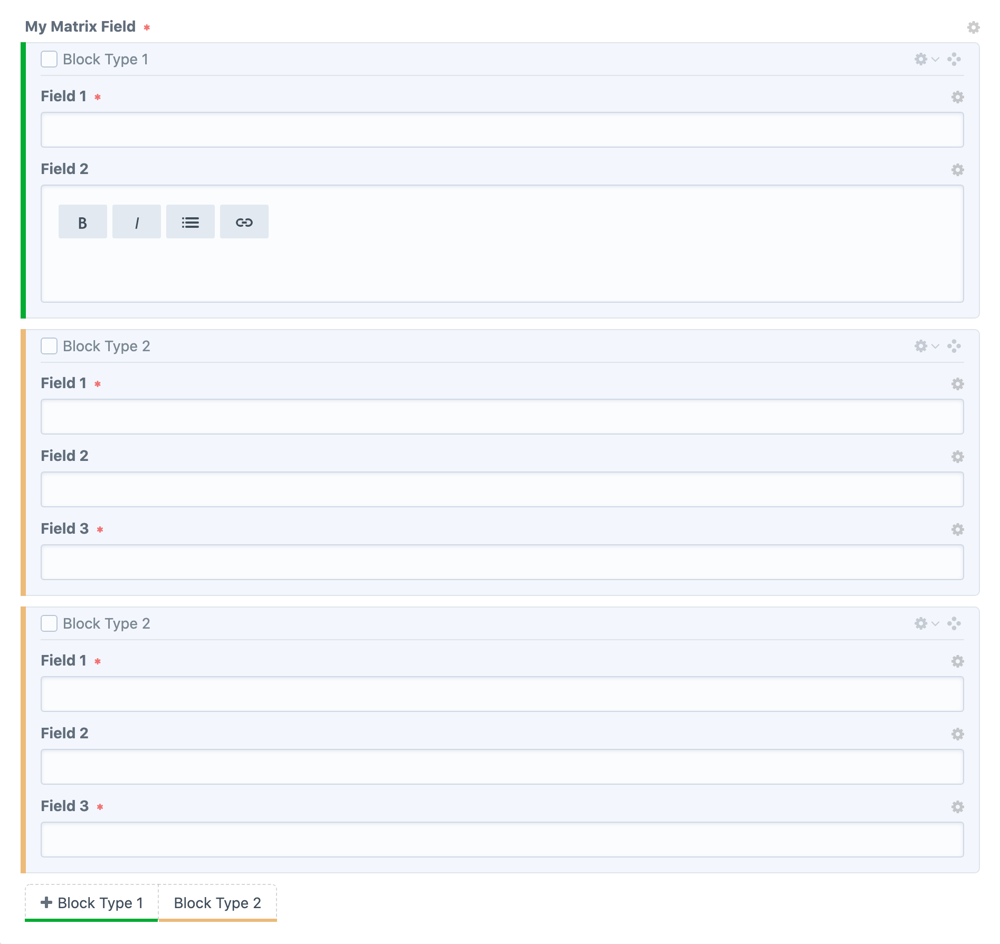

# Matrix Colours plugin

Define colours for your matrix field blocks to help visually separate them



## Requirements

This plugin requires Craft CMS 3.0.0-beta.23 or later.

## Installation

To install the plugin, follow these instructions.

1. Open your terminal and go to your Craft project:

        cd /path/to/project

2. Then tell Composer to load the plugin:

        composer require paulgoodfield/craft-matrix-colours

3. In the Control Panel, go to Settings → Plugins and click the “Install” button for **Matrix Colours**.

## Configuring Matrix Colours

Once installed, create a `matrix-colours.php` file in your `config` directory. This file should return an associative array with the following structure:

```php
<?php
return [
    'matrixFieldHandle' => [
        'blockType1' => '#00AB31',
        'blockType2' => '#ECBA79'
    ],
    'anotherMatrixFieldHandle' => [
        'blockType1' => '#03FCB6',
        'blockType2' => '#D303FC'
    ]
];
```
